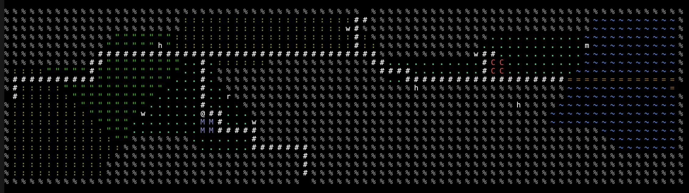

# This is a game I made over the course of a semester in my course Com S 327

The game is designed as a classic roguelike where the world is drawn using ASCII graphics and features the player exploring a procedurally generated world with the player and the enemies getting stronger as they move further from the start.

The first half of the project was written in C but then the codebase was converted to C++ which was used to complete the rest of the game.

## Features

### Map Generation

The game world is a 400 x 400 grid of randomly generated tiles. The tiles are generated by placing biome tiles at random points on them and then growing them outward by expanding them each by one each round and stopping when they run into each other. Then any roads, buildings, and rivers are placed on top of the map. 

*One of the map tiles*

### Enemy AI

On every map tile there will be trainers who will battle the player if they are ever on the same tile. Every trainer has a specific type which determines their behavior.
- Pacers: Move back and forth in a straight line turning around when they encounter a tile they cannot encounter. Represented by a 'p'
- Wanderers: Move by randomly selecting a tile each turn and moving into it. They won't enter certain tiles (such as mountains, or water) and won't leave the biome they spawned in. Represented by a 'w'.
- Explorers: Move by randomly selecting a tile each turn and moving into it. They won't enter certain tiles (such as mountains, or water) and but can move into different biomes. Represented by an 'e'.
- Swimmers: Move around randonmly like wanderers and explorers but can't leave the water. If the player is on the shore or a bridge the swimmer will rush towards them.  Represented by an 'm'.
- Rivals: Move towards the player using the quickest possible route (determined using Dijkstra's algorithm). Can't enter mountain, forest, or water biomes. Represented by an 'r'.
- Hikers: Move towards the player using the quickest possible route (determined using Dijkstra's algorithm). Can enter any biome except for water. Represented by an 'h'.

### Battles

Players can enter into battles with trainers or Pokemon, when in tall grass biomes, when in the battles the player has four options. Fight, Bag, Run, and swap Pokemon.

*Battle UI where the player can select an option.*

#### Fight
If the player chooses to fight they will have the option to select a move for their Pokemon to make to damage the opponent.

 
*Select a move*

*Results of a Pokemon's attack*

#### Run

If the player is in a battle with a wild Pokemon choosing the run option will end the battle

#### Bag 

If the player chooses the bag option they will be able to choose to use one of their items: either potions, which can heal Pokemon or recharge their moves, or Pokeballs which can be used to catch wild Pokemon.

| The options present to the player in the bag | Pokemon being caught by the player |
| :------------------------------------------: | :--------------------------------: |
| |  |

#### Swap Pokemon

If the player selects this option they will be able to change their current Pokemonm to a different one in their party.

## How to play

### Compile and Run

Compile the game using the provided Makefile by typing `make` into the terminal of a machine with [Make](https://www.gnu.org/software/make/) and [GCC](https://gcc.gnu.org/) installed.
This will produce the poke327 executable file which can be run with `./bin/poke327`

### Controls

You can control the game with the standard Roguelike controls or the Numpad
The controls map as:
    7 or y - Move diagnolly to the upper left space \
    8 or k - Move up one space \
    9 or u - Move diagnolly to the upper right space \
    6 or l - Move one space to the right. \
    3 or n - Move diagnolly to the lower right space. \
    2 or j - Move up one space. \
    1 or b - Move diagnolly to the lower left. \
    4 or h - Move one space to the left  \
    > - If on a building (Building's are represented with either a 'C' or an 'M') enter the building \
    < - Exit a building \
    5 or spacebar or . - Rest for a turn. NPCs still move. \
    t - Display a list of trainers on the map and their position relative to the player \
        The list can be scrolled with the up and down arrows. Exit the list with the 'esc' key \
    Q - Quit the game.

## Acknowledgments 
Credit to https://github.com/veekun/pokedex for the Pokedex data

    
